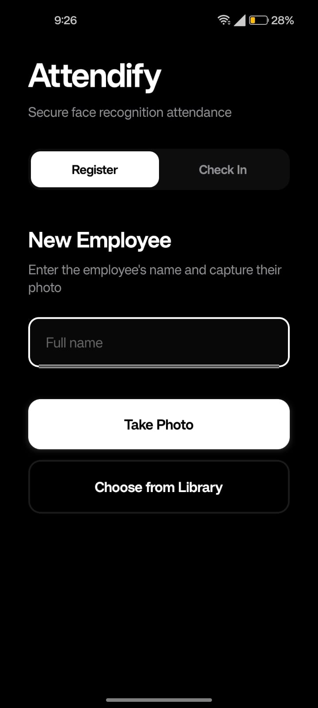
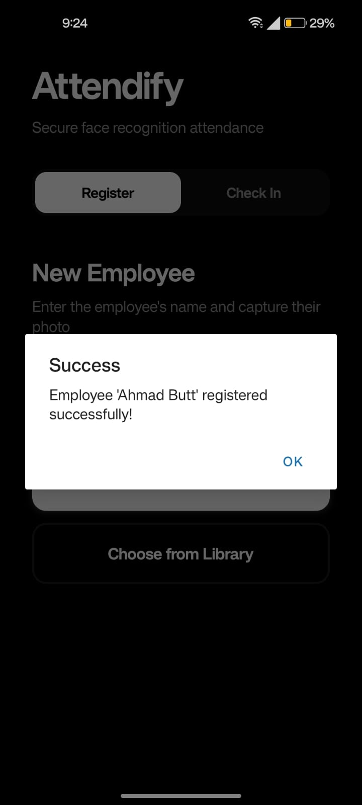
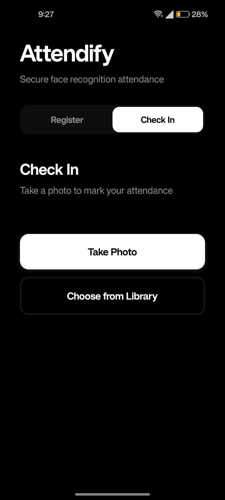

# 🎯 Attendify

<div align="center">


[](https://python.org)
[](https://fastapi.tiangolo.com)
[](LICENSE)

**Intelligent Face Recognition-Based Attendance Management System**

*Automate attendance tracking with AI-powered facial recognition and liveness detection*

[Features](#-features) • [Demo](#-demo) • [Quick Start](#-quick-start) • [API](#-api-endpoints) • [Tech Stack](#-tech-stack)

</div>

---

## 🚀 Features

- 🤖 **AI-Powered Recognition** - FaceNet deep learning for 95%+ accuracy
- 👁️ **Anti-Spoofing** - Liveness detection prevents photo/video fraud
- ⚡ **Lightning Fast** - Mark attendance in under 2 seconds
- 🔒 **Privacy First** - Stores only face embeddings, never raw images
- 🌐 **RESTful API** - Easy integration with any platform
- 📊 **Real-time Tracking** - Instant attendance records and analytics
- 💾 **Zero Proxy** - Eliminates buddy punching completely

---

## 📸 Demo


<p align="center">
  
  <br>
  <em>Seamless employee registration with face capture and liveness detection</em>
</p>

<p align="center">
  
  <br>
  <em>Instant attendance marking with facial recognition and verification</em>
</p>

<p align="center">
  
  <br>
  <em>Complete attendance history and analytics at your fingertips</em>
</p>

---

## 🛠️ Tech Stack

```
Backend      → FastAPI (Python)
ML Models    → FaceNet, dlib
Computer Vision → OpenCV
Database     → SQLite
Deep Learning → Keras
```

---

## ⚡ Quick Start

### Prerequisites
- Python 3.8+
- Camera/Webcam

### Installation

```bash
# Clone the repository
git clone https://github.com/ahmadmustafa02/FaceRecognitionAttendanceSystem.git
cd attendify

# Create virtual environment
python -m venv venv
source venv/bin/activate  # On Windows: venv\Scripts\activate

# Install dependencies
pip install -r requirements.txt

# Download dlib shape predictor
# Place in: data/shape_predictor_68_face_landmarks.dat

# Initialize database
python database/db_setup.py

# Run the server
python main.py
```

🎉 **Server running at** `http://localhost:8000`

---

## 🔌 API Endpoints

### Register Employee
```bash
POST /api/register
curl -X POST "http://localhost:8000/api/register" \
  -F "name=John Doe" \
  -F "image=@face.jpg"
```

### Mark Attendance
```bash
POST /api/mark-attendance
curl -X POST "http://localhost:8000/api/mark-attendance" \
  -F "image=@face.jpg"
```

### Get Attendance Records
```bash
GET /api/attendance/{name}
curl "http://localhost:8000/api/attendance/John%20Doe"
```

📖 **[Full API Documentation](docs/API.md)**

---

## 🏗️ Architecture

```
┌─────────────┐      ┌──────────────┐      ┌─────────────┐
│   Client    │─────▶│  FastAPI     │─────▶│  FaceNet    │
│  (Camera)   │      │   Server     │      │   Model     │
└─────────────┘      └──────────────┘      └─────────────┘
                            │                      │
                            ▼                      ▼
                     ┌──────────────┐      ┌─────────────┐
                     │  Liveness    │      │  SQLite     │
                     │  Detection   │      │  Database   │
                     └──────────────┘      └─────────────┘
```

---

## 🎯 How It Works

1. **Registration** 📝
   - Capture face image
   - Liveness check (blink detection)
   - Generate 512-D face embedding
   - Store in database

2. **Attendance** ✅
   - Capture face image
   - Validate liveness
   - Match with stored embeddings
   - Mark attendance with timestamp

---

## 🔐 Security Features

- ✅ Face embeddings only (no image storage)
- ✅ Blink-based liveness detection
- ✅ 68 facial landmark analysis
- ✅ Encrypted database storage
- ✅ GDPR-ready architecture

---

## 📊 Results

| Metric | Performance |
|--------|-------------|
| Recognition Accuracy | **95%+** |
| Response Time | **<2 seconds** |
| Liveness Detection | **90%+** |
| Time Saved | **90%** |
| Proxy Attempts | **0** |

---

## 🚧 Roadmap

- [ ] Multi-face detection
- [ ] Web admin dashboard
- [ ] Mobile app (React Native)
- [ ] Face mask detection
- [ ] GPU acceleration
- [ ] Cloud deployment
- [ ] HR system integration

---

## 📝 Project Structure

```
attendify/
├── data/                    # ML models
├── database/               # DB operations & schema
├── models/                 # FaceNet & liveness
├── services/               # Face recognition logic
├── main.py                 # FastAPI application
└── requirements.txt        # Dependencies
```

---

## 👥 Authors

**Ahmad Mustafa** - [GitHub](https://github.com/ahmadmustafa02)  
**Malik Saad Hayat** - [GitHub](https://github.com/maliksaadhayat)

*COMSATS University, Islamabad*

---

## 📄 License

This project is licensed under the MIT License - see the [LICENSE](LICENSE) file for details.

---

## 🙏 Acknowledgments

- [FaceNet](https://arxiv.org/abs/1503.03832) - Face recognition architecture
- [dlib](http://dlib.net/) - Facial landmark detection
- [FastAPI](https://fastapi.tiangolo.com/) - Modern Python web framework
- [keras-facenet](https://github.com/nyoki-mtl/keras-facenet) - Pre-trained models

---

<div align="center">

### ⭐ Star this repo if you find it useful!

Made with ❤️ by COMSATS Students

[Report Bug](https://github.com/saadhtiwana/Attendify/issues) • [Request Feature](https://github.com/saadhtiwana/Attendify/issues)

</div>
